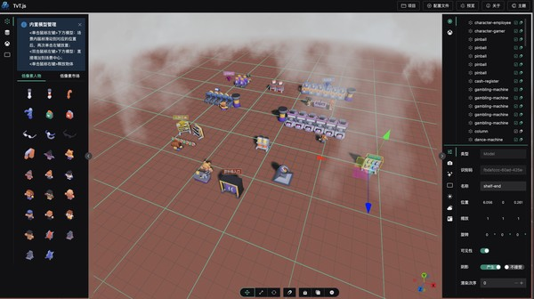

# Three-Vue-Tres 🧳🧳🧳 TvT.js 🧳🧳🧳
使用 TresJS 建構互動式 3D 場景的 Vue 3 框架。

文件說明（語言）：繁體中文（筆記用）| [简体中文](./README_zh.md) | [English](./README.en.md)

## 🎉🎉🎊 三維視覺化專案快速落地的開源框架 🎊🎉🎉


## Web 三維視覺化框架 

詳細說明文件，[點擊查看詳情](https://docs.icegl.cn/docs/three-vue-tres/guide/localization.html)
```shell
- 您可以將 tvt.js 作為國產化三維視覺化專案、數位孿生平台的前端技術底座。
- 我們在所有依賴完全開源的基礎上，擁有自主軟體智慧財產權和著作權，開源且免費商用。
```


# 生態系統 `@ThreeJS @Vue3.x @TresJS`

> 由 icegl 出品，永久開源免費商用，持續更新中。請點右上角「Star⭐」追蹤關注。

本專案整合三大生態系統：

- 🎠 ThreeJS \* [詳情](https://threejs.org) 知名的瀏覽器端 3D JavaScript 函式庫。

- 🍀 Vue3.x \* [詳情](https://vuejs.org) 易學易用、效能優秀、應用場景豐富的 Web 前端框架。

- ⚡ TresJS \* [詳情](https://tresjs.org) 以 Vue3 元件宣告式撰寫 ThreeJS 的前端 3D 框架。

## 🏥 線上預覽：[🌏 opensource.icegl.cn](https://opensource.icegl.cn)

- 如存取較慢，請使用鏡像：[🌏 oss.icegl.cn](http://oss.icegl.cn/)
- 若可使用 VPN，請使用 GitHub Pages 鏡像：[🌏 https://hawk86104.github.io](https://hawk86104.github.io/)


> 相關技術棧拓撲圖【包含完整專案原始碼】:
<a href="./src/plugins/zoneFreeScene/pages/freeTvtStack.vue">git 專案原始碼地址</a>


<table style="border: none; width: 100%; text-align: center;">
  <tr>
    <td style="padding:10px;font-size:1.2em;">
      <a href="https://zone3deditor.icegl.cn/#/plugins/zone3Deditor/index">
        線上三維場景編輯器：[🪅免費匯出原始碼＋二次開發]
      </a>
    </td>
    <td style="padding:10px;font-size:1.2em;">
      <a href="https://www.icegl.cn/tvtstore/zoneMachinRoom">
        智慧機房：[編輯器直接落地專案]
      </a>
    </td>
  </tr>
  <tr>
    <td style="padding: 10px;">
      <a href="https://zone3deditor.icegl.cn/#/plugins/zone3Deditor/index" style="display:block;max-width:100%;">
        
      </a>
    </td>
    <td style="padding: 10px;">
      <a href="https://www.icegl.cn/tvtstore/zoneMachinRoom" style="display:block;max-width:100%;">
        
      </a>
    </td>
  </tr>
  <tr>
    <td style="padding:10px;font-size:1.2em;">
      <a href="https://www.icegl.cn/tvtstore/zoneRefiningIndustry">
        煉化智能工廠視覺化：[編輯器直接落地專案]
      </a>
    </td>
    <td style="padding:10px;font-size:1.2em;">
      <a href="https://www.icegl.cn/tvtstore/zoneOfficeFloor">
        智慧辦公空間：[編輯器直接落地專案]
      </a>
    </td>
  </tr>
  <tr>
    <td style="padding: 10px;">
      <a href="https://oss.icegl.cn/p/zoneRefiningIndustry/#/plugins/zoneRefiningIndustry/index" style="display:block;max-width:100%;">
        
      </a>
    </td>
    <td style="padding: 10px;">
      <a href="https://oss.icegl.cn/p/zoneOfficeFloor/#/plugins/zoneOfficeFloor/index" style="display:block;max-width:100%;">
        
      </a>
    </td>
  </tr>
  <tr>
    <td style="padding:10px;font-size:1.2em;">
      <a href="https://www.icegl.cn/tvtstore/zoneLowAltitudeUAV.html">
        無人機組視覺化：[編輯器直接落地專案]
      </a>
    </td>
    <td style="padding:10px;font-size:1.2em;">
      <a href="https://opensource.icegl.cn/#/#zoneFreeScene">
        低像素煉油廠：[免費]
      </a>
    </td>
  </tr>
  <tr>
    <td style="padding: 10px;">
      <a href="https://www.icegl.cn/tvtstore/zoneLowAltitudeUAV.html" style="display:block;max-width:100%;">
        
      </a>
    </td>
    <td style="padding: 10px;">
      <a href="https://zone3deditor.icegl.cn/#/plugins/zone3Deditor/index?sceneConfig=freeRefiningIndustry" style="display:block;max-width:100%;">
        
      </a>
    </td>
  </tr>
</table>


```shell
若因專案頻繁更新部署導致存取異常，請清除瀏覽器快取後重試。
```

<a href="https://opensource.icegl.cn"></a>
<a href="https://opensource.icegl.cn"></a>
<a href="https://opensource.icegl.cn"></a>


更多範例請至預覽頁面查看。

# 優勢

- 🌈 前端基礎建設 \* FesJS [詳情](https://fesjs.mumblefe.cn) 整合圖示、i18n、API 呼叫、狀態管理（Vuex/Pinia）、版面配置／權限／路由管理等函式庫。

- 🌠 像撰寫 Vue3.x 一樣開發 3D 視覺化專案 [詳情](https://tresjs.org/guide) 完整支援最新版 ThreeJS，可交替使用現代 Vue3 語法與 TS/JS。

```html
<template>
  <TresCanvas window-size>
    <TresPerspectiveCamera />
    <TresMesh>
      <TresTorusGeometry :args="[1, 0.5, 16, 32]" />
      <TresMeshBasicMaterial color="orange" />
    </TresMesh>
  </TresCanvas>
</template>
<script setup lang="ts">
  import { useLoop } from '@tresjs/core'
  import { useTextures } from 'PLS/basic'
  const pTexture = await useTextures(['./**.jpg', './**.png'])
  const { onLoop } = useLoop()
  onBeforeRender(({ delta }) => {
      // 渲染迴圈
  })
</script>
```

### 請給予支持：追蹤 💛 按讚 ⭐ Fork 👣

# ✅ 快速開始

```js
1. git clone 或下載本專案
2. cd 至專案根目錄
3. yarn          // 安裝依賴 [node -v >= 20.18]
4. yarn pre.dev  // 預覽除錯模式
5. yarn dev      // 專案除錯模式
6. yarn pre.build    // 建置預覽版
7. yarn build        // 建置專案版
8. yarn pre.dev.one  // 預覽特定範例／插件
9. yarn pre.build.one  // 打包特定範例／插件
10. yarn both    // 同時啟動 dev 與 pre.dev
```

## 本地預覽建置結果

打包完成後，使用以下指令在本地啟動靜態伺服器預覽 `dist/` 內容：

```shell
npx serve dist -s
```

> `-s` 為 SPA 模式，所有路由導向 `index.html`，確保 `/#/plugins/...` 等路由正常運作。  
> 啟動後開啟 `http://localhost:3000` 即可瀏覽。

# 📖 文件

## 使用指南：[🌏docs.icegl.cn](https://docs.icegl.cn/)
<table style="border: none; width: 100%; text-align: center;">
  <tr>
    <td style="padding:10px;font-size:1.2em;">
      <a href="https://docs.icegl.cn/docs/three-vue-tres/editor/threeeditor.html">
        3D 編輯器：[📊原生編輯器＋插件產生器]
      </a>
    </td>
    <td style="padding:10px;font-size:1.2em;">
      <a href="https://docs.icegl.cn/docs/three-vue-tres/editor/goview.html">
        UI 編輯器：[📊GoView 匯出＋設定匯入元件]
      </a>
    </td>
  </tr>
  <tr>
    <td style="padding: 10px;">
      <a href="https://docs.icegl.cn/docs/three-vue-tres/editor/threeeditor.html" style="display:block;max-width:100%;">
        
      </a>
    </td>
    <td style="padding: 10px;">
      <a href="https://docs.icegl.cn/docs/three-vue-tres/editor/goview.html" style="display:block;max-width:100%;">
        
      </a>
    </td>
  </tr>
  <tr>
    <td style="padding:10px;font-size:1.2em;">
      <a href="https://docs.icegl.cn/docs/three-vue-tres/frontend/uniapp.html">
        uniapp 小程式生態：[一套程式碼，全平台解決方案]
      </a>
    </td>
    <td style="padding:10px;font-size:1.2em;">
      <a href="https://docs.icegl.cn/docs/three-vue-tres/qiankun/introduction.html">
        Qiankun 微前端：[無縫整合至現有專案]
      </a>
    </td>
  </tr>
  <tr>
    <td style="padding: 10px;">
      <a href="https://docs.icegl.cn/docs/three-vue-tres/frontend/uniapp.html" style="display:block;max-width:100%;">
        
      </a>
    </td>
    <td style="padding: 10px;">
      <a href="https://docs.icegl.cn/docs/three-vue-tres/qiankun/introduction.html" style="display:block;max-width:100%;">
        
      </a>
    </td>
  </tr>
</table>


# ™️ 版權聲明

本專案以 Apache 2.0 開源授權釋出，提供終身免費使用，並允許商業應用。

> 若您將本專案用於商業用途，請遵守 Apache 2.0 授權條款並保留作者技術支援聲明。

-   以商業用途或與開源競品進行二次開發時，請勿移除或修改 TvT.js 原始碼頂部的版權、作者聲明或來源歸屬。
-   允許商業使用，但禁止二次開源並收費。

本專案中包含的第三方原始碼及二進位檔案的版權資訊將另行標註。

Copyright © 2022-2026 by 🧊icegl (https://www.icegl.cn)

All rights reserved。
